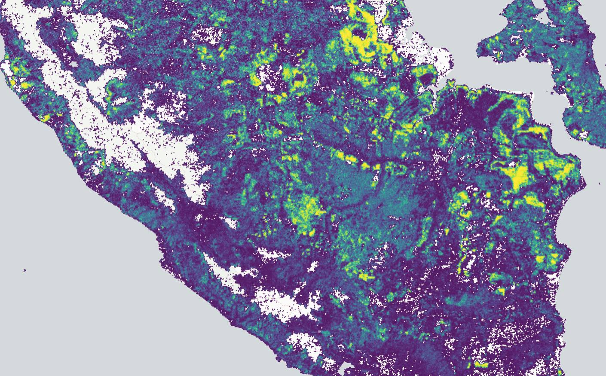

# h3 Tiles


A simple tiler for h3 data.

This repo can be considered as a _reference implementation_ of what is needed to build a h3 tiling system and a
possible approach (not necessarily the best).

The repo is structured as:

```
.
├── db                              <- Postgres DB setup example
├── demo                            <- Demo client app
├── h3tile-layer                    <- deck.gl custom layer module
├── scripts
│   ├── raster_to_h3.py             <- Script for creating the h3 data from a file
│   └── h3_file_to_db_table.py      <- Copy the h3 data from a file to a postgres table
├── src                             <- The tiler service done in FastAPI
│   └── h3tiler
│       └── adapters                <- Adapter for getting data from a postgres database
│
├── docker-compose.yml              <- Spin it all up
...
```

## Usage

### Docker

just do

```bash
docker compose up --build
```

then run the scripts in `scripts/` to populate the database.

### Local Demo

To run the client in `demo/` run:

```bash
npm install
```

then:

```bash
npm start
```

to spin the tiler, in `src/`, run:

```bash
python -m uvicorn h3tiler.main:app --reload
```
